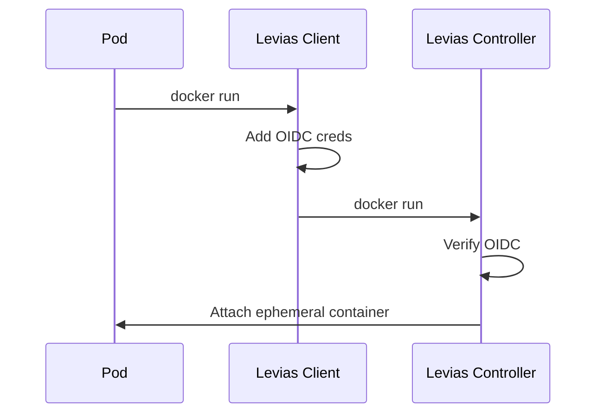

# levias

Proof-of-concept running docker-in-docker without priviledge in Kubernetes.

Currently Pods use `privilege: true` in order to talk to the host to attach
containers to the current pod.
[Ephemeral containers (stable as of k8s 1.25)](https://kubernetes.io/docs/concepts/workloads/pods/ephemeral-containers/)
gives us a mechanism to have a similar behavior using k8s API primatives.

Levias provides an alternative
[moby(https://github.com/moby/moby/blob/master/api/README.md)] implementation
that:

1. Wraps the the buildkit TCP API implementation with OIDC credentials
2. Implements a server that transforms buildkit API requests to ephemeral
   containers.

